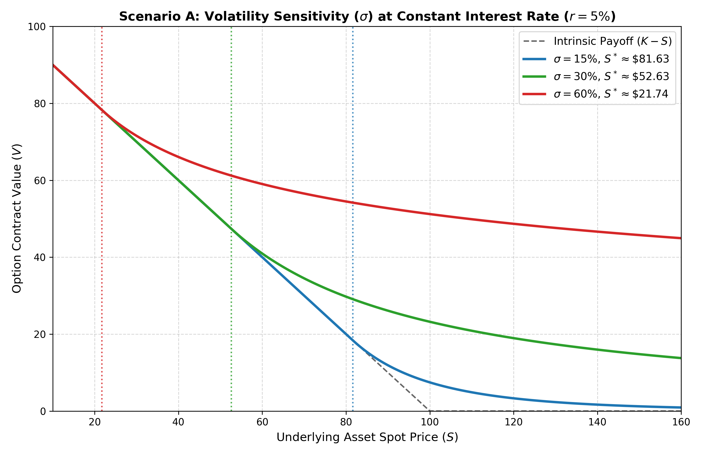
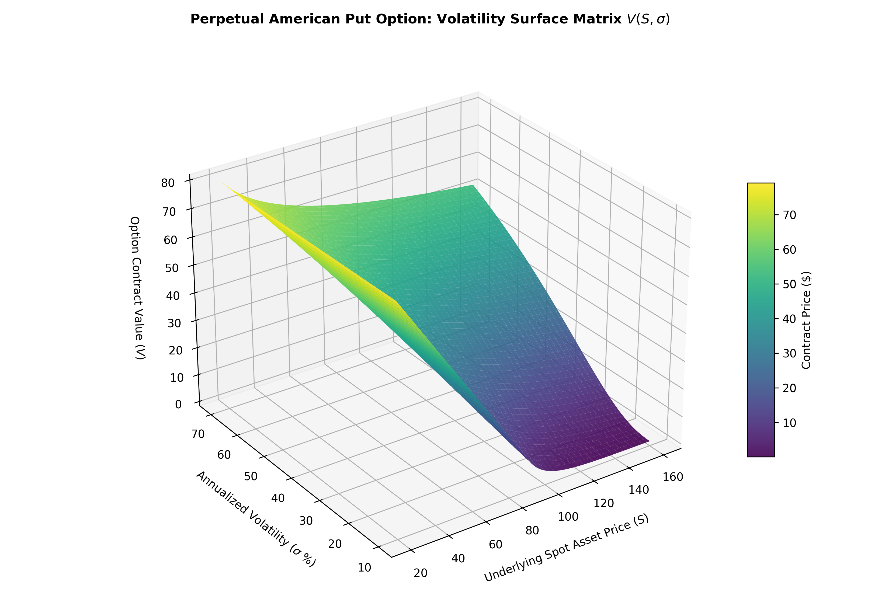

# Application of Ordinary Differential Equations in Quantitative Finance: Pricing Perpetual American Options

[English](#english) | [中文](#中文)

---
## English

This repository contains the LaTeX source code, Python numerical simulation suite, and final report for the project **"Application of Ordinary Differential Equations in Quantitative Finance: Pricing Perpetual American Options"** (Course: MAT109).

### 📌 Project Overview
This project explores the mathematical framework of valuing financial derivatives using differential equations. By eliminating calendar time dependency from the classic Black-Scholes partial differential equation (PDE) under a perpetual horizon ($T \to \infty$), the pricing model collapses into a single-variable second-order linear homogeneous Cauchy-Euler ordinary differential equation (ODE). 

The repository provides a complete analytical derivation, rigorous boundary limit proofs, and a highly-optimized Python simulation engine capable of mapping parameter sensitivities across 2D plots and 3D surface topologies.

## 📊 Visualization & Results

### 1. 2D Sensitivity Profiles


### 2. 3D Pricing Surface Topologies


### 🚀 Key Features
- **Analytical Solution:** Complete step-by-step mathematical proof utilizing the power-law ansatz for Cauchy-Euler systems.
- **Boundary Conditions:** Exact structural enforcement of Far-Field, Value-Matching, and Smooth-Pasting criteria to solve the free-boundary problem.
- **Python Simulation Engine:** Fully vectorized NumPy implementation to calculate option prices, optimal exercise boundaries ($S^*$), Delta ($\Delta$), and Gamma ($\Gamma$).
- **Visual Risk Analytics:** Generating 2D sensitivity curves and interactive 3D Matplotlib surface topologies for market volatility ($\sigma$) and risk-free rates ($r$).
- **Academic Report:** Ready-to-compile XeLaTeX document tailored for university submission guidelines.

### 🛠️ Installation & Setup

### Prerequisites
Make sure you have Python 3.8+ and a standard TeX distribution (e.g., MacTeX, MiKTeX, or TeX Live) installed.

### Step 1: Clone the Repository
```bash
git clone [https://github.com/YOUR_USERNAME/ODE_for_Financial_Engineering.git](https://github.com/YOUR_USERNAME/ODE_for_Financial_Engineering.git)
cd ODE_for_Financial_Engineering
```
### Step 2: Install Dependencies    
```bash
pip install -r requirements.txt     
```

### step 3: Activate env
```bash
source env/bin/activate
```
### Step 4: RUn SImulations
Execute the main script to regenerate the data tables and visualization plots:
```bash
python main.py  
```
### Step 5:Compile the LaTeX Report
To resolve references cleanly without folder path space glitches, ensure the parent directory has no spaces (e.g., `ODE_for_Financial_Engineering`). Run the compilation sequence:
```bash
xelatex report_template.tex
bibtex report_template
xelatex report_template.tex
xelatex report_template.tex
```
### 📁 Repository Structure
```text
├── report_template.tex   # Primary XeLaTeX source code
├── refs.bib              # Cleaned BibTeX bibliography database
├── main.py               # Vectorized Python simulation engine
├── requirements.txt      # Python package dependencies
├── LICENSE               # MIT License
└── README.md             # Project documentation
```
### 👥 Author Information
- **Zhang Boting**
- **Xiamen University Malaysia (XMUM)**
---
## 中文

### 常微分方程在量化金融中的应用：永续美式期权定价

本仓库包含了 **"常微分方程在量化金融中的应用：永续美式期权定价"**（课程：MAT109）项目的 LaTeX 源代码、Python 数值模拟套件以及最终学术报告。

### 📌 项目概述
本项目探讨了利用微分方程对金融衍生品进行估值的数学框架。通过在永续视界（$T \to \infty$）下消除经典 Black-Scholes 偏微分方程（PDE）中的日历时间依赖性，定价模型简化为单变量的二阶线性齐次 Cauchy-Euler 常微分方程（ODE）。

本仓库提供了完整的解析解推导、严密的边界极限证明，以及高度优化的 Python 模拟引擎，能够映射 2D 敏感性曲线图和 3D 拓扑曲面。

### 🚀 核心功能
- **解析解推导：** 利用幂律假设（Power-law ansatz）求解 Cauchy-Euler 系统的完整步骤数学证明。
- **自由边界条件：** 严格执行远场边界（Far-Field）、价值匹配（Value-Matching）和光滑粘贴（Smooth-Pasting）条件，精准求解最佳行权边界（$S^*$）。
- **Python 模拟引擎：** 基于 NumPy 的全向量化代码实现，高效计算期权价格、最佳行权点、Delta ($\Delta$) 和 Gamma ($\Gamma$)。
- **风险可视化分析：** 自动生成针对市场波动率（$\sigma$）和无风险利率（$r$）的 2D 敏感性曲线与交互式 3D Matplotlib 曲面图。
- **学术报告模板：** 适配大学论文提交规范、开箱即用的 XeLaTeX 文档。

## 🛠️ 安装与使用

### 环境要求
请确保您的系统中已安装 Python 3.8+ 以及标准的 TeX 发行版（如 MacTeX、MiKTeX 或 TeX Live）。

### 步骤 1：克隆仓库
```bash
git clone [https://github.com/YOUR_USERNAME/ODE_for_Financial_Engineering.git](https://github.com/YOUR_USERNAME/ODE_for_Financial_Engineering.git)
cd ODE_for_Financial_Engineering
```
### 步骤 2：安装依赖项
```bash
pip install -r requirements.txt
```
### 步骤 3：启动虚拟环境
```bash
source env/bin/activate
```
### 步骤 4：运行模拟
执行主脚本以重新生成数据表和可视    
```bash
python main.py
```
### 步骤 5: 编译 LaTeX 报告
为了避免编译器由于文件夹路径包含空格而报错，请确保父级文件夹名称中不包含空格（例如使用下划线：ODE_for_Financial_Engineering）。在终端依次运行以下编译命令：

```bash
xelatex report_template.tex
bibtex report_template
xelatex report_template.tex
xelatex report_template.tex
```

### 仓库架构
```text
├── report_template.tex   # 主 XeLaTeX 源代码
├── refs.bib              # 清理后的 BibTeX 文献数据库
├── main.py               # 向量化 Python 模拟引擎
├── requirements.txt      # Python 依赖包声明
├── LICENSE               # MIT 许可证
└── README.md             # 项目英文/中文档说明
```
### 👥 作者信息
- **Zhang Boting**
- **Xiamen University Malaysia (XMUM)**
